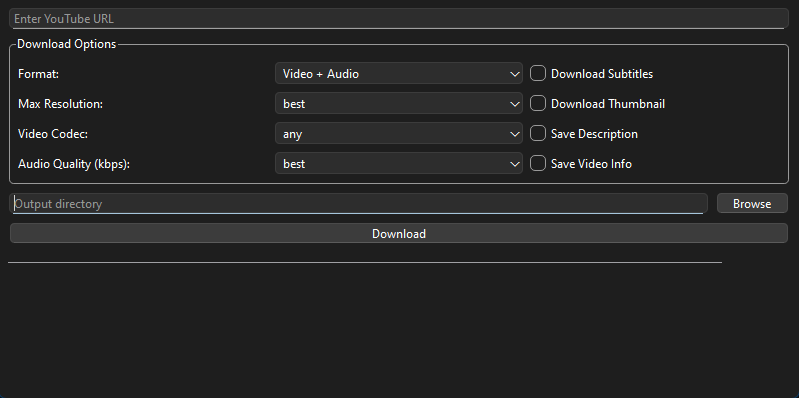

# YouTube Downloader

A PyQt6-based GUI application for downloading YouTube videos with advanced options.

## Prerequisites

- Python 3.10 or higher
- Anaconda/Miniconda
- ffmpeg (required for merging video and audio)

## Installation

### 1. Create Conda Environment

Open Anaconda Prompt and run:
```bash
# Create new environment
conda create -n ytdl-gui
conda activate ytdl-gui

# Install required packages
pip install PyQt6
pip install yt-dlp
conda install -c conda-forge ffmpeg

or

pip install -r requirements.txt
```
### For Docker(coming soon)
```bash
# From D:\src\download_video
docker build -t youtube-downloader-gui -f docker/Dockerfile .

# Mount the downloads directory
docker run --rm -p 5900:5900 -v "D:/src/download_video/downloads:/downloads" youtube-downloader-gui
```
### 2. Install ffmpeg
You have several options to install ffmpeg:

#### Option 1: Using Conda (Recommended)
```bash
conda install ffmpeg -c conda-forge
```

#### Option 2: Manual Installation
1. Download ffmpeg from https://www.gyan.dev/ffmpeg/builds/
2. Extract the zip file
3. Add the `bin` folder to your system's PATH environment variable

To add to PATH:
1. Search for "Environment Variables" in Windows
2. Click "Environment Variables"
3. Under "System Variables", find and select "Path"
4. Click "Edit"
5. Click "New"
6. Add the path to ffmpeg's bin folder (e.g., `C:\ffmpeg\bin`)
7. Click "OK" on all windows

#### Option 3: Using yt-dlp
```bash
yt-dlp -U
yt-dlp --update-to nightly
pip install --force-reinstall yt-dlp
```

## Usage

1. Run the program:
```bash
python ytdl_gui.py
```

2. Enter a YouTube URL

3. Configure download options:

   - **Format:**
     - Video + Audio: Downloads highest quality video and audio (requires ffmpeg)
     - Video Only: Downloads only video stream
     - Audio Only: Downloads only audio stream

   - **Max Resolution:**
     - best: Highest available quality
     - 2160p (4K)
     - 1440p (2K)
     - 1080p (Full HD)
     - 720p (HD)
     - 480p (SD)
     - 360p
     - 240p
     - 144p

   - **Video Codec:**
     - any: Any available codec
     - avc1: H.264
     - vp9: WebM
     - av01: AV1

   - **Audio Quality:**
     - best: Highest available quality
     - 192 kbps
     - 128 kbps
     - 96 kbps
     - 64 kbps

4. Additional Options:
   - Download Subtitles (English)
   - Download Thumbnail
   - Save Description
   - Save Video Info (JSON)

5. Choose output directory

6. Click "Download"

## Troubleshooting

### Common Issues

1. **"ffmpeg is not installed" error:**
   - This means ffmpeg is missing or not in PATH
   - Follow the ffmpeg installation steps above

2. **"URL not found" error:**
   - Check if the YouTube URL is valid
   - Make sure you have internet connection

3. **Download fails at 0%:**
   - Try updating yt-dlp:
     ```bash
     pip install --upgrade yt-dlp
     ```

4. **Video quality not available:**
   - The downloader will automatically select the next best available quality
   - Not all videos are available in all resolutions

### Error Messages

- `ERROR: Unable to download video`: Check your internet connection
- `ERROR: Unsupported URL`: Make sure the URL is from YouTube
- `ERROR: Video is unavailable`: The video might be private or deleted

## Dependencies

- PyQt6: GUI framework
- yt-dlp: Video downloader
- ffmpeg: Media processor

## Notes

- Downloads are saved to the specified output directory
- File names are based on video titles
- The downloader respects YouTube's terms of service
